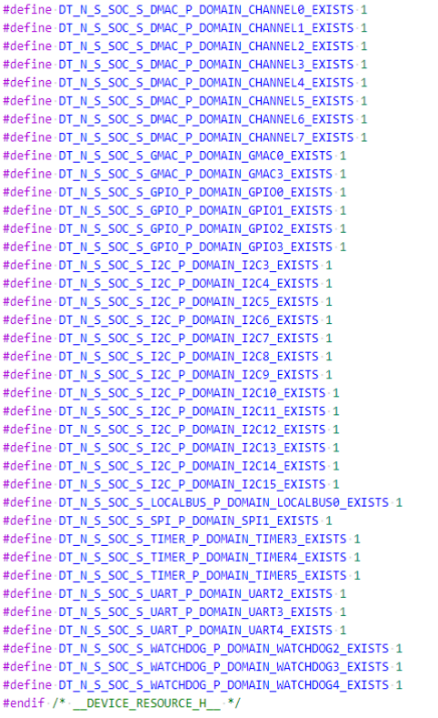
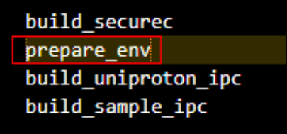
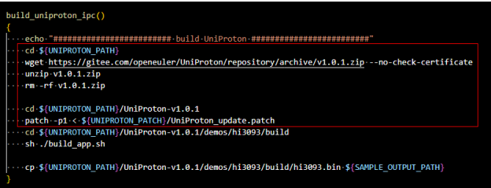
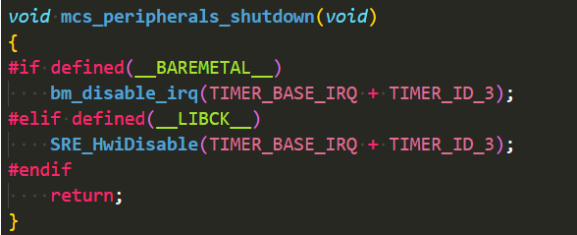
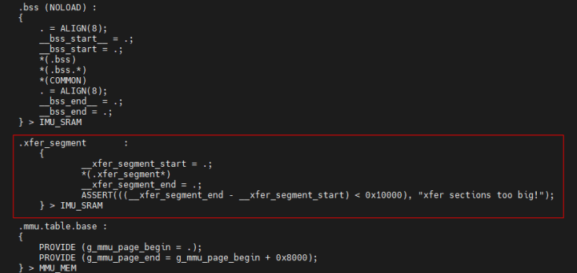

# HiEulerOS开发调试FAQ

## 1. 驱动添加指导

**步骤1** 在`mpu_solution/src/real_time/drivers`目录下新增文件夹，文件夹名为驱动名称（以下以xxx_driver为例）。

**步骤2** 在xxx_driver文件夹下新建 *.c、*.h、Makefile 文件（以下以xxx_driver.c为例）。

**步骤3** Makefile中文件内容为：
```
obj-y +=xxx_driver.o
CFLAGS += -I./
```

**步骤4** 修改`mpu_solution/src/real_time/drivers`目录下Makefile，在最后一行新增如下内容。
```
obj-y += xxx_driver/
```

**步骤5** 在`mpu_solution/src/real_time/drivers/include`文件夹下新增bm_xxx_driver.h头文件，该头文件内容为对外暴露的接口及结构体等。

**步骤6** 进入`mpu_solution/build/build_baremetal`目录下，执行./build_baremetal.sh即可。

## 2. 可用外设资源

本章针对于混合部署系统中驱动提供隔离使用方案指南。

参考`src/real_time/drivers/include/device_resource.h`，实时侧可用的外设资源宏定义如下：



如若使用GMAC2，需在头文件中定义，如：
```
#define DT_N_S_SOC_S_GMAC_P_DOMAIN_GMAC2_EXISTS 1
```

## 3. I2C、SPI、DMAC的使用
1. I2C、SPI、DMAC异步接口需要用户注册一个callback。

2. callback需要用户自己实现，callback原型为(以I2C举例)：
    ```
    typedef void (*bm_i2c_callback)(bm_i2c_ids, bm_xxx_transmit_async_t)；
    ```

3. callback示例：
    ```
    static void i2c_transmit_async_callback(bm_i2c_ids i2c_id, bm_i2c_transmit_async_t type)
    {
        printf(“transmit_id = %d, transmit_status = %d\n”, bm_i2c, type);
    }
    ```

4. 在传输完成或者传输失败时，参数bm_i2c_ids 和bm_i2c_transmit_async_t由中断函数传入，用户通过判定bm_i2c_ids来确认传输的通道，通过bm_i2c_transmit_async_t来判定传输状态。

5. 验证
    - 在I2C和SPI中：
        - 传输状态值0表示写成功；
        - 传输状态值1表示写失败；
        - 传输状态值2表示读成功；
        - 传输状态值3表示读失败。
    - 在DMAC中：
        - 传输状态值0表示写成功；
        - 传输状态值1表示写失败。

## 4. NET的使用
1. 用户新增网络phy芯片时，需自行适配网络phy驱动。

2. 用户使用网络驱动时，需自行保证网卡mac地址唯一性（在调用bm_net_init接口后，通过bm_net_set_mac_addr接口设置网卡mac地址）。

3. int bm_net_set_mac_addr(bm_eth eth, const unsigned char *mac_addr)*；调用该接口设置mac地址时需要用户保证mac_addr指向的数组大于6个字节。

## 5. IPC性能测试方法
特别说明：
1. open_source/mcs/library/rpmsg_endpoint.c中rpmsg_service_receive_loop函数中画红色方框地方建议修改值50，如果单次发送数据量过大，可以改为更大的数值；修改部分如下所示：

    

    ```
    if (elapsed_time >= 20) {
        poll_timeout = -1;
    }
    ```
    - 4字节、8字节、16字节：建议数值改为30。
    - 32字节、64字节、128字节：建议数值改为60。
    - 256字节：建议数值改为70。
    
2. 计算方式：

    定时器：ticker = openEuler侧ticker减去baremetal侧ticker（或者其他实时侧ticker），重复三次，每次来回2499个数据，单位为tick。

    时间：ticker* 40 / 1000，单位微秒。


### 5.1 UniProton测试方法

**前提条件**：按照[《openEuler+UniProton混合部署方案编译运行指南》2.2 统一构建镜像](./openEuler+UniProton混合部署方案编译运行指南.md)章节内容完成制作openEuler+UniProton镜像。

**步骤1** 执行如下命令编译sample程序，生成组件位于build/build_hi3093/output目录下。

```
cd mpu_solution/build
source build_prepare.sh
source build_exports
cd build_hi3093
source ~/hi3093_tool/toolchain/environment-setup-aarch64-openeuler-linux
./build_ipc_uniproton.sh
```
        
1. 如果多次执行build_ipc_uniproton.sh时，需要注释该脚本中，图5-1与图5-2中红框部分内容。

    图5-1 脚本注释函数示意图

    

    图5-2 build_uniproton_ipc.sh 脚本注释示意图

    


2. 同时还需要注释掉`hi-mpu/src/real_time/UniProton/UniProton-v1.0.1/demos/hi3093/build`目录下`build_openamp.sh`脚本中如图5-3画红色方框部分。

    图5-3 UniProton 中注释示意图

    

3. 如果需要修改其他字节测试，按照如下方式修改sample代码：

    - `mpu_solution/src/samples/non_real_time/ipc/common/sample_ipc_common.c`文件的`pty_endpoint_cb`函数中chars_len的大小；

    - `mpu_solution/src/real_time/uniproton/UniProton-v1.0.1/demos/hi3093/apps/openamp/rpmsg_service.c`文件的`rpmsg_endpoint_cb`函数中data_len参数大小与pty_endpoint_cb中chars_len保持一致。
    
**步骤2** 修改rpmsg_libck_ipc与hi3093.bin执行权限。
```
chmod 755 rpmsg_uniproton_ipc
chmod 755 hi3093.bin
```

**步骤3** 运行sample程序。
```
./rpmsg_uniproton_ipc -c 3 -t hi3093.bin -a 0x93000000
```

## 6. 虚拟串口使用
在`mpu_solution/src/real_time/libck/include/sre_common.h`中需要修改如下代码：
```
#define CONFIG_VIRTUAL_SERIAL 1
```

## 7. 下电资源释放
混合部署下电前需要用户自行去实现weak函数mcs_peripherals_shutdown关闭所用资源，如图7-1所示:

图7-1 mcs_peripherals_shutdown函数



## 8. 串口打印
UniProton的打印函数最大支持512字符长度的字符串语句，且默认打开。

## 9. openEuler_tcpdump编译
**步骤1** 从以下路径下载openEuler-22.03-LTS-SP3交叉编译链到~/hi3093_tool目录。

[https://mirror.truenetwork.ru/openeuler/openEuler-22.03-LTS-SP3/embedded_img/aarch64/qemu-aarch64/openeuler-glibc-x86_64-openeuler-image-aarch64-qemu-aarch64-toolchain-22.03-LTS-SP3.sh](https://mirror.truenetwork.ru/openeuler/openEuler-22.03-LTS-SP3/embedded_img/aarch64/qemu-aarch64/openeuler-glibc-x86_64-openeuler-image-aarch64-qemu-aarch64-toolchain-22.03-LTS-SP3.sh)

**步骤2** 执行如下命令。
```
sh openeuler-glibc-x86_64-openeuler-image-aarch64-qemu-aarch64-toolchain-22.03-LTS-SP3.sh -d /home/${USER}/hi3093_tool/toolchain/ -y \
```

**步骤3** 配置openEuler交叉编译环境，执行如下命令。
```
 . /home/${USER}/hi3093_tool/toolchain/environment-setup-aarch64-openeuler-linux
```

**步骤4** 编译tcpdump。
```
cd mpu_solution/build/build_tools
./build_tcpdump.sh
```
`mpu_solution/build/build_tools/output`目录生成tcpdump文件。

**须知**：执行机上需先安装pkg-config工具（sudo apt install pkg-config ）

## 10. 实时侧驱动数据传输接口地址保护开关

由于网络安全需要，避免驱动数据传输接口被恶意利用导致系统挂死，所有驱动数据传输接口默认会校验输入数据地址，保证源地址和目的地址都在数据传输专用的数据段上xfer_segment，客户应用程序的链接脚本必须显式定义该数据段（如图10-1所示），并在声明待传输数据时加上XFER_DATA字段（如图10-2所示）。

用户也可以手动关闭此项地址校验：在src/real_time/drivers/include/bm_common.h中将BM_ADDR_PROTECT删除掉。

**图10-1** 链接脚本样例



**图10-2** XFER_DATA数据声明样例


## 11. uboot控制台读写EMMC和SFC

### 11.1 sfc读写

以下使用以Hi3093单板u12为例：

1. 驱动加载

    `sf probe 0:0`

2. 擦除

    `sf erase offset len` 从flash的offset位置擦除len个字节，len必须是0x10000也就是64KB的整数倍

3. 读取flash内容到内存指定地址

    `sf read addr offset len` 从flash的offset位置读取len个字节到内存addr位置

4. 从内存指定地址写内容到flash

    `sf write addr offset len` 从内存的addr位置开始向flash的offset位置写len个字节

### 11.2 EMMC读写

以下使用以usr区为例，block大小为512字节，十六进制需以0x开头输入，否则视为十进制：

1. eMMC初始化

    `mmc_init`

2. 分区切换

    `mmc_switch 0` 切换至eMMC user分区。（0为分区标号,0:user,1-2:boot,3:RPMB,4-7:GPP）

#### 11.2.1 低速读写接口

1. 读取emmc内容到内存指定地址

    mmc_rd addr offset len 从eMMC编号为offset的block开始读取len个block到内存addr位置。

2. 从内存指定地址写内容到eMMC

    mmc_wr addr offset len 从内存addr位置开始向eMMC的offset编号block开始写len个block。

#### 11.2.2 高速读写接口

1. 读取emmc内容到内存指定地址

    mmc_dma_rd addr offset len 从eMMC编号为offset的block开始读取len个block到内存addr位置。

2. 从内存指定地址写内容到eMMC

    mmc_dma_wr addr offset len 从内存addr位置开始向eMMC的offset编号block开始写len个block。

