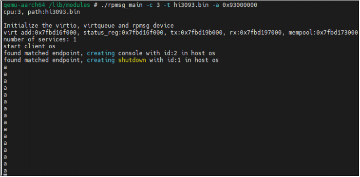

# 1. 概述

混合部署框架提供了以下功能：

-	openEuler文件系统的编译制作
-	支持UniProton以及UniProton的用例编译
-	支持混合部署中3核使用openEuler，1核使用UniProton的场景

用户可以通过以上提供的三个功能实现混合部署的方案。

# 2. 编译参考

## 2.1 快速构建

这部分可以参考[《openEuler系统编译运行指南》](./openEuler系统编译运行指南.md)中的 1.1 和 1.2 章节, 唯一需要注意的是，编openEuler+UniProton版本，在执行1.2小节步骤4中所介绍的 `./build.sh`命令时，需要选择 oe_uniproton。编译生成的文件在`hi-mpu/build/build_hi3093/output`目录下：
- u-boot_rsa_4096.bin: uboot。
- Hi3093_ext4fs_cms.bin: 文件系统签名。
- Hi3093_ext4fs.img: 文件系统，里面包含uImage和设备树。

## 2.2 分模块编译

### 2.3.1 源码及环境准备
sdk编译、uboot制作、uImage制作跟[《openEuler系统编译运行指南》](./openEuler系统编译运行指南.md)中描述的一致。

### 2.3.2 mcs编译

混合关键性系统（MCS, Mixed Criticality System），实现在一颗片上系统中部署多个OS，同时提供Linux的服务管理能力以及实时OS带来的高实时、高可靠的关键能力。软件架构如下所示：

- mcs_km：提供OpenAMP所需内核模块，支持Client OS启动、专用中断收发、管理保留内存等功能。
- rpmsg_pty_demo：提供OpenAMP用户态程序Linux端样例，支持在Linux上通过pty设备访问Client OS。
- library：提供OpenAMP样例必需的模块remoteproc、virtio、rpmsg、openamp。

**步骤1** 完成统一构建镜像（即Hi3093_ext4fs.img）的编译后，如果需要重新打开shell窗口运行mcs模块，则需要执行如下命令。
```
source ~/hi3093_tool/toolchain/environment-setup-aarch64-openeuler-linux
cd mpu_solution/build
source build_exports
source build_prepare.sh
```

**步骤2** 进入build/build_hi3093目录，执行如下命令编译对应openAMP与Libmetal。
```
cd mpu_solution/build/build_hi3093sh 
./build_openamp.sh
```

**步骤3** 进入build/build_uniproton目录，执行如下命令。
```
cd mpu_solution/build/build_uniproton
sh ./build_mcs.sh
```

**步骤4** 生成文件：`mpu_solution/build/build_uniproton/output`

## 2.3.3 UniPronton的编译

**步骤1** 首先完成Hi3093 SDK编译。

**步骤2** 编译生成hi3093.bin。
```
cd mpu_solution/build/build_uniproton
./build_uniproton.sh
```

生成的hi3093.bin在`mpu_solution/build/build_uniproton/output`目录下。

# 3. 混合部署烧写运行指南

## 3.1 混合部署烧写启动指南

**步骤1** flash用烧录器烧写好后，将SFC颗粒放入3093单板U12对应位置的底座中，注意颗粒1脚位置，需要将颗粒上标有小圆点的角对准单板上的小圆点，否则会引起SFC短路烧毁。

**步骤2** 检查拨码开关SW1，以on侧为1，记SW1，1\~4为1110，即1\~3开关拨至on侧，4开关拨至对侧。

**步骤3** 接通电源，串口接J26，网线接J12，打开电源开关，完成从flash的启动。

**步骤4** 将编译好的烧片包hi3093_ext4.tar.gz传输至板端/tmp目录，并完成解压。

**步骤5** 执行`mkdir /mnt/update`创建镜像挂载目录，执行`mount -t ext4 -o loop /tmp/Hi3093_ext4fs.img /mnt/update/`完成镜像挂载。

**步骤6** 执行`cp -rf /mnt/update/* /run/media/mmcblk0pX`将编译好的镜像中的文件系统拷贝至X分区，并执行`reboot`重启至uboot控制台

**步骤7** 启动emmc usr区镜像
- 执行`env delete bootargs`删除bootargs（欧拉和混合部署的bootargs使用dts中存
储的）
- 执行`setenv boot_kernel_media 1`将镜像加载介质切换至emmc usr区（默认为0启动sfc镜像）
- 执行`setenv part2_user_offset Y`将emmc usr区读取的起始sector设置为想启动的usr分区的起始sector（例:mmcblk0p2起始sector设置为了6324224，这里的Y为(6324224 -144)的十六进制，为0x607f70）
- 最后执行`saveenv`保存以上环境变量并执行`run bootcmd`启动emmc usr区镜像。

**须知**

如果emmc还没分好user 分区，请参考 [《openEuler系统编译运行指南》](./openEuler系统编译运行指南.md)中`SFC从emmc非安全启动`小节分区

## 3.2 混合部署运行指南

启动并进入系统后，依次执行：

**步骤1** 进入lib/modules目录，执行如下命令。
```
cd /lib/modules
insmod mcs_km.ko
```

**步骤2** 将编译好的rpmsg_main、hi3093.bin通过网络传输到单板上的同一文件夹下（不能够放在tmp目录）。
- rpmsg_main位于mpu_solution/build/build_uniproton/output中。
- hi3093.bin位于mpu_solution/build/build_uniproton/output中。

并执行如下命令。
```
./rpmsg_main -c 3 -t hi3093.bin -a 0x93000000
```

**步骤3** 执行完步骤2后，出现下图打印结果



**须知**
下电功能仅支持核间通信mcx

