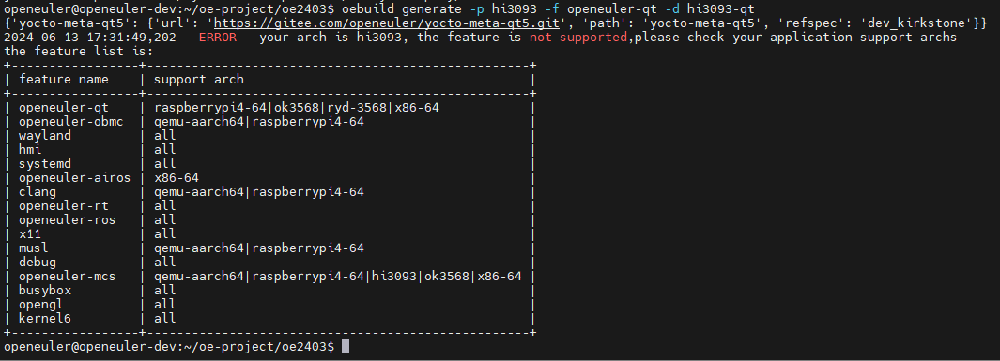
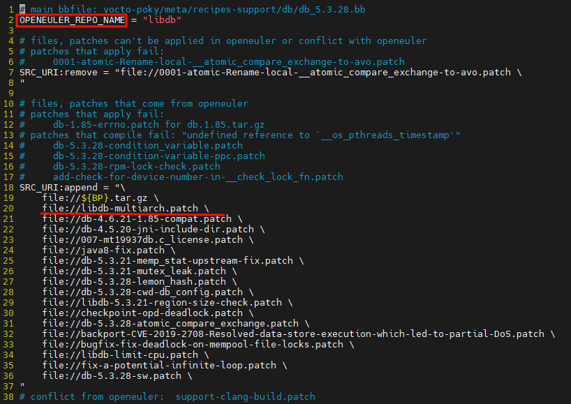
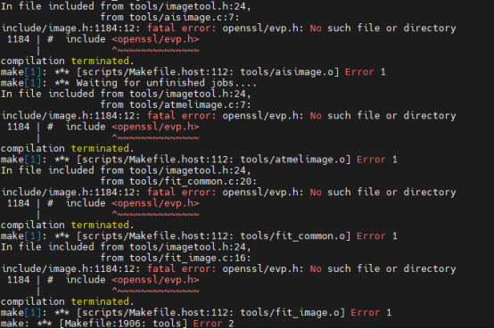
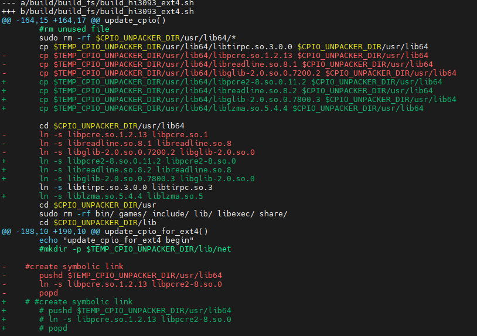
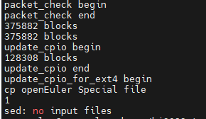

# openEuler系统编译运行常见FAQ

## 1. 构建openEuler文件系统与zImage镜像

### 1.1 概述

构建常见问题，主要是针对在构建openEuler文件系统与zImage镜像过程中的错误进行记录。oebuild是基于python语言实现的，使用该工具需在编译环境内安装python3.8以上的的和版本进行使用，详见 [https://gitee.com/openeuler/oebuild.git](https://gitee.com/openeuler/oebuild.git) 介绍。

### 1.2 FAQ

#### Q1: oebuild初始化过程中输入-b版本参数，但是update时，下载的版本不一致。或update过程中失败。


**Answer:**

将oebuild版本进行更新，旧版本oebuild可能无法拉取新版本的openEuler构建代码。

oebuild升级命令：
```shell
pip3 install oebuild --upgrade
```

------------

#### Q2: oebuild generate过程输入qt的特性参数，结果显示不支持当前硬件



**Answer:**

当前qt特性是支持移植到Hi3093中的，但是oebuild的清单文件中的硬件支持列表还未添加Hi3093。

将openeuler-qt.yaml文件中`support: raspberrypi4-64|ok3568|ryd-3568|x86-64`内容删除。
```
cd ./src/yocto-meta-openeuler/.oebuild/features/
vi openeuler-qt.yaml
```


------------

#### Q3: 修改配置文件后，发现defconfig把arm64等基本内核配置被关闭。

**Answer:**

在使用X86的编译环境时，在生成和修改内核配置文件时需要加上ARCH=arm64参数，否则会导致使用默认的目标体系结构，将arm64关闭。
```shell
# 依据defconfig生成.config配置文件
make ARCH=arm64 defconfig CROSS_COMPILE=aarch64-openeuler-linux-

# 使用交互式菜单修改.config配置文件
make menuconfig ARCH=arm64 CROSS_COMPILE=aarch64-openeuler-linux-
```

------------

#### Q4: 修改了配置文件，打开了QT相关驱动，但是在编译Hi3093烧片包内却没有相关驱动文件。

**Answer:**

- 可以通过查看`hi-mpu/open_sourse/linux5.10/`目录下是否编译出了修改后打开的驱动文件，来判断是否是配置文件的问题。（该内核编译使用的配置文件是在hi-mpu/custom/openeuler/目录下。）
- 如果配置文件没有问题，可能文件系统存在问题，由于不同openEuler版本在构建过程中使用的defconfig文件路径不同，确认配置文件以及在构建文件系统时已经进行了替换
	- openEuler24.03-LST：src/yocto-meta-openeuler/bps/meta-hisilicon/recipes-kernel/linux/files/config/hi3093
    - openEuler22.03-LST-SP3：src/yocto-meta-openeuler/meta-openeuler/recipes-kernel/linux/files/config/

------------

#### Q5: fetch失败问题，提示unable to fetch。由于网络问题，在bitbake openeuler-image时拉取文件失败。

**Answer:**

例如file://libdb-multiarch.patch：

在src/yocto-meta-openeuler目录下，通过`grep -rnw libdb-multiarch`找到在哪个bbappend文件中配置了该链接。


通过编辑器查看该bbappend文件，记住文件中的OPENEULER_REPO_NAME变量。



在src/yocto-meta-openeuler/.oebuild/manifest.yaml文件中有该库的下载链接。最后在src目录下，手动下载该库。


------------

## 2. 编译Hi3093烧片包

### 2.1 概述

编译该镜像过程中使用到了多种工具，在编译时最为常见的问题时command not found错误，用户可依据自身编译环境进行安装，较为常见未安装的工具有：flex 、bison、cmake、dtc、openssl等。

### 2.2 FAQ
#### Q1：网络问题无法安装工具链

**Answer:**

由于默认使用的交叉编译工具链镜像仓位于欧洲，可能存在网络问题无法下载成功，可通过手动下载进行安装。

镜像仓链接：[https://www.openeuler.org/zh/mirror/list/](https://www.openeuler.org/zh/mirror/list/)

工具链路径（以22.03-LTS-SP3为例）：`openEuler-22.03-LTS-SP3/embedded_img/aarch64/qemu-aarch64/openeuler-glibc-x86_64-openeuler-image-aarch64-qemu-aarch64-toolchain-22.03-LTS-SP3.sh`

安装命令：
```shell
sh openeuler-glibc-x86_64-openeuler-image-aarch64-qemu-aarch64-toolchain-22.03-LTS-SP3.sh -d /home/${USER}/hi3093_tool -y
```

<span style="color:#0066cc;">**须知**</span>

- 工具链安装路径推荐安装在`/home/${USER}/hi3093_tool`下，如安装至其他路径，需同步修改其他脚本文件内的`TOOLCHAIN_DIR`变量为修改后的路径。
- 不同的镜像仓工具链存在差异，推荐使用Truenetwork仓、HUAWEI-CLOUD仓，安装后可通过在目录`/home/${USER}/hi3093_tool/toolchain`下，通过以下代码验证SDK路径是否为工具链的路径。
```shell
source environment-setup-aarch64-openeuler-linux
echo ${SDKTARGETSYSROOT}
```

正确的输出路径应为：`/home/${USER}/hi3093_tool/toolchain/sysroots/aarch64-openeuler-linux`（交叉编译工具链安装位置）。

------------

#### Q2：无法找到openssl下的库文件。



**Answer:**

安装openssl开发包即可，如果使用的是Ubuntu或Debian系统，可以通过以下命令安装openssl的开发包：
```shell
sudo apt-get install libssl-dev
```

如果使用的是CentOS或Red Hat系统，可以通过以下命令安装openssl的开发包：
```shell
sudo yum install openssl-devel
```

------------

#### Q3：在打包Hi3093烧片包时，无法复制文件系统内的某些库文件。


**Answer:**

由于不同openEuler版本构建的文件系统不同，一些库文件在新的openEuler版本进行了更新，如上图中的libpcre库文件，在openEuler22.03中为libpcre.so.1.2.13，而在openEuler24.03中为libpcre2-8.so.0.11.2。

可通过修改`hi-mpu/build/build_fs/build_hi3093_ext4.sh`脚本文件解决该问题。

以openEuler24.03为例：



------------

#### Q4： 在打包Hi3093烧片包替换文件报错。



**Answer:**

这也是由于不同openEuler版本构建的文件系统不同导致的，在替换文件时，找不到输入文件。将脚本文件`build_hi3093_ext4.sh`的对应命令注释即可。

以openEuler24.03为例：


------------

#### Q5：pushd、source、log_error等基础工具not found。


**Answer:**

这些基础工具一般都是内置在bash解释器下，使用命令`ls -l /bin/sh`查看sh解释器是否指向bash。
如果指向其他解释器，可能会导致该错误，例如dash，可通过以下两种方法执行：

1. 情况允许的话，最好可以将编译环境的sh指向bash解释器，命令：sudo dpkg-reconfigure dash 选择no 关闭dash解释器。
2. 也可以通过在报错的文件首行加上 #!/bin/bash，并在运行该文件的命令从sh XXX.sh 改为 ./XXX.sh